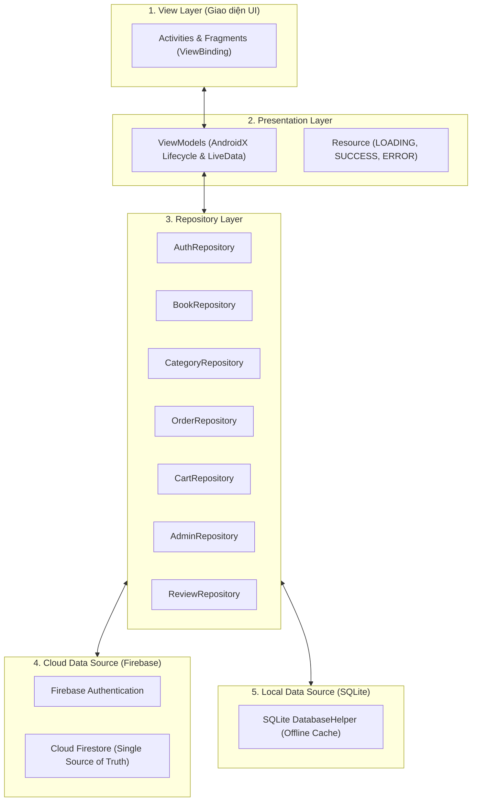

# 📚 BookStore App - Ứng Dụng Bán Sách Trực Tuyến (Android Java)

Ứng dụng thương mại điện tử bán sách trực tuyến hoàn chỉnh trên nền tảng **Android Native (Java 11)**, tuân thủ kiến trúc phân tầng chuẩn **MVVM (Model-View-ViewModel) + Repository Pattern**, kết nối đám mây **Firebase (Authentication, Cloud Firestore)** và hỗ trợ đệm ngoại tuyến với **SQLite (Offline-first & Dual-readiness)**.

---

## 🌟 Tính Năng Nổi Bật

### 👤 Phân hệ Khách hàng (User Features)
- **Đăng ký / Đăng nhập / Đổi mật khẩu**: Xác thực trực tiếp qua Firebase Authentication, quản trị phiên bằng `SessionManager`.
- **Trang chủ & Khám phá sách**: Banner nổi bật, sách bán chạy, danh mục thể loại trực quan, thanh tìm kiếm nhanh.
- **Tìm kiếm & Bộ lọc thông minh**: Lọc đa tiêu chí theo thể loại, khoảng giá (min - max), mức đánh giá rating, sắp xếp theo giá tăng/giảm hoặc độ phổ biến.
- **Chi tiết cuốn sách**: Đầy đủ thông tin bìa, tác giả, giá gốc, tỷ lệ giảm giá, mô tả chi tiết, số lượng tồn kho và danh sách đánh giá của khách hàng.
- **Giỏ hàng & Đặt hàng (Checkout)**: Tăng/giảm số lượng, tính tổng tiền tự động, hỗ trợ thanh toán COD, chuyển khoản ngân hàng và ví điện tử.
- **Lịch sử & Chi tiết đơn hàng (Order Details)**: Theo dõi trạng thái đơn hàng (`CHỜ XỬ LÝ`, `ĐÃ DUYỆT`, `ĐANG GIAO`, `ĐÃ GIAO`, `ĐÃ HỦY`), xem danh sách chi tiết các cuốn sách trong đơn và viết đánh giá sản phẩm.

### 👑 Phân hệ Quản trị viên (Admin Features)
- **Bảng điều khiển (Dashboard)**: Thống kê tổng quan doanh thu từ đơn thành công, tổng đơn hàng, đơn chờ duyệt, tổng số đầu sách và số lượng người dùng.
- **Quản lý kho sách (Books Management)**: Danh sách sách, thêm mới sách, chỉnh sửa thông tin sách, ảnh bìa, danh mục, cập nhật tồn kho, xóa sách.
- **Quản lý thể loại (Categories Management)**: Thêm mới thể loại, sửa tên thể loại, xóa thể loại (có kiểm tra ràng buộc không cho xóa khi còn sách).
- **Quản lý đơn hàng (Orders Management)**: Lọc đơn theo trạng thái, xem chi tiết từng món hàng khách đặt, duyệt đơn (`CONFIRMED`), chuyển giao (`SHIPPING`), hoàn thành (`DELIVERED`) hoặc hủy đơn.
- **Quản lý tài khoản (Users Management)**: Danh sách toàn bộ người dùng, quyền hạn, công tắc bật/tắt khóa tài khoản người dùng tức thì.

---

## 🏗 Kiến Trúc Hệ Thống (Architecture)

Ứng dụng được xây dựng theo kiến trúc phân tầng khuyến nghị bởi Google Android:



- **Mô hình Remote First + Offline Fallback**: Khi có kết nối mạng, dữ liệu tự động đồng bộ thời gian thực với Cloud Firestore. Khi mất mạng, ứng dụng vẫn hiển thị mượt mà từ bộ đệm SQLite.
- **ViewBinding**: Loại bỏ hoàn toàn `findViewById`, đảm bảo type-safety và null-safety khi tương tác với các thành phần giao diện.

---

## 🔑 Tài Khoản Trải Nghiệm Mẫu

Hệ thống đã được thiết lập sẵn 2 tài khoản trên Firebase Authentication và Cloud Firestore:

| Loại tài khoản | Email | Mật khẩu | Quyền hạn (Role) |
|---|---|---|---|
| **Quản trị viên** | `admin@gmail.com` | `admin123` | `ADMIN` (Truy cập toàn bộ chức năng Admin & User) |
| **Khách hàng** | `user@gmail.com` | `user123` | `USER` (Mua hàng, xem đơn, đánh giá) |

---

## 🛠 Công Nghệ Sử Dụng

- **Ngôn ngữ**: Java 11 (Android SDK 34, Min SDK 26)
- **Giao diện**: XML Layouts, Material Design 3, ViewBinding, ConstraintLayout, RecyclerView, CardView
- **Xử lý hình ảnh**: Bumptech Glide 4.16.0
- **Kiến trúc**: AndroidX Lifecycle (ViewModel 2.6.2, LiveData 2.6.2), AppExecutors
- **Cơ sở dữ liệu cục bộ**: SQLite (`DatabaseHelper`)
- **Đám mây**: Firebase BoM 33.7.0 (`firebase-auth`, `firebase-firestore`, `firebase-storage`)

---

## 🚀 Hướng Dẫn Cài Đặt & Chạy Ứng Dụng

1. **Clone repository về máy:**
   ```bash
   git clone https://github.com/Utabus/BookStoreApp.git
   ```
2. **Mở dự án:**
   - Khởi động **Android Studio**.
   - Chọn **Open** $\rightarrow$ Trỏ đến thư mục chứa mã nguồn vừa clone.
3. **Cấu hình Firebase:**
   - Dự án đã được cấu hình sẵn file `app/google-services.json`.
4. **Build & Run:**
   - Chờ Gradle Sync hoàn tất.
   - Chọn máy ảo Android (Emulator) hoặc thiết bị thật (API 26+) và bấm **Run (Shift + F10)**.

---
© 2026 BookStore Team - Đồ Án Lập Trình Di Động (Java).
